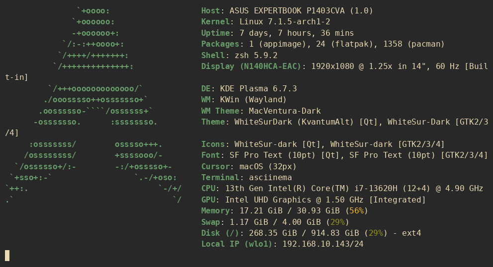

<div align="center">

# MyConfigNeovim
###### Neovim .lua configuration pack I made and sharing to anyone who dont want to spend whole day just for customizing Neovim but still want a fancy look of it (like me).


</div>

## Usage
#### Installing (Updating)
###### GNU/Linux
```bash
bash <(curl -fSsL https://raw.githubusercontent.com/whilnew/MyConfigNeovim/refs/heads/main/scripts/install.sh)
```
###### Windows (WIN32)
```powershell
# Not yet supported.
# Dont worry, you can still download the repo as .zip and extract it to %LOCALAPPDATA%\nvim (C:\Users\<YourUsername>\AppData\Local\nvim)
```

#### Keymaps
###### Navigation
|            Keys            |           Descriptions            |            Mode          |
|----------------------------|-----------------------------------|--------------------------|
|Alt + 1                     |Jump to beginning of line          | Normal / Visual / Insert |
|Alt + 2                     |Jump to end of line                | Normal / Visual / Insert |
|Alt + k                     |Scroll up 1/3 of the screen lines  | Normal / Visual / Insert |
|Alt + j                     |Scroll down 1/3 of the screen lines| Normal / Visual / Insert |
|Alt + 0                     |Scroll to top of file              | Normal / Visual / Insert |
|Alt + 9                     |Scroll to bottom of file           | Normal / Visual / Insert |
|Alt + h                     |Left                               | Normal / Visual / Insert |
|Alt + j                     |Down                               | Normal / Visual / Insert |
|Alt + k                     |Up                                 | Normal / Visual / Insert |
|Alt + l                     |Right                              | Normal / Visual / Insert |
|Alt + J<br>(Alt + Shift + j)|Down                               | Normal / Visual / Insert |
|Alt + K<br>(Alt + Shift + k)|Up                                 | Normal / Visual / Insert |
|Alt + o                     |New line and Insert                | Normal / Visual / Insert |

###### Navigation (buffer)
|             Keys             |   Descriptions     |          Mode            |
|:----------------------------:|--------------------|--------------------------|
|Alt + ]                       |Next buffer         | Normal / Visual / Insert |
|Alt + [                       |Previous buffer     | Normal / Visual / Insert |
|Alt + \|<br>(Alt + Shift + \\)|Close current buffer| Normal / Visual / Insert |

###### Tools
|   Keys   |                     Descriptions                      |  Mode  |
|----------|-------------------------------------------------------|--------|
|Space + ex|Open / Close File <u>**Ex**</u>plorer                  | Normal |
|Space + ff|<u>**F**</u>ind <u>**f**</u>iles in project            | Normal |
|Space + sk|<u>**S**</u>earch <u>**k**</u>eyword across the project| Normal |
|Space + lb|<u>**L**</u>ist open <u>**b**</u>uffers                | Normal |

###### In buffers
|           Keys             |                      Descriptions                        |           Mode           |
|----------------------------|----------------------------------------------------------|--------------------------|
|Alt + M<br>(Alt + Shift + m)|Open / Close the <u>**M**</u>ark<u>**d**</u>own viewer    | Normal / Visual / Insert |
|Alt + d                     |<u>**J**</u>ump to function/variable <u>**d**</u>efinition| Normal / Visual / Insert |
|Alt + i                     |View documentation/type info                              | Normal / Visual / Insert |
|Alt + r                     |Rename variable across the project                        | Normal / Visual / Insert |
|Alt + v                     |View all references to this function                      | Normal / Visual / Insert |
|Alt + a                     |Quick fix (Code Action)                                   | Normal / Visual / Insert |
|Alt + F<br>(Alt + Shift + f)|Format code                                               | Normal / Visual / Insert |

